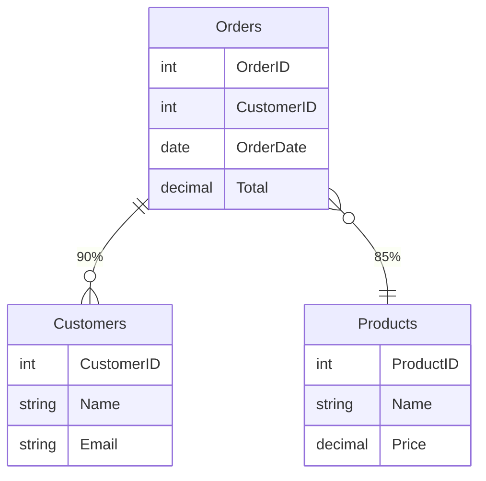

# 6-Stage Qlik-to-Power BI Migration Pipeline

**Complete Implementation Guide**

## Architecture Overview

```
Qlik Cloud API
     ↓
┌────────────────────────────────────────┐
│  STAGE 1: Extract Metadata             │
│  - Get tables, fields, data types      │
│  - File: stage1_qlik_extractor.py      │
└────────────────────────────────────────┘
     ↓
┌────────────────────────────────────────┐
│  STAGE 2: Relationship Inference       │
│  - Name-based matching (ID patterns)  │
│  - Confidence scoring (0.75-0.95)     │
│  - File: stage2_relationship_inference.py
└────────────────────────────────────────┘
     ↓
┌────────────────────────────────────────┐
│  STAGE 3: Normalize to JSON            │
│  - Standard Power BI schema            │
│  - Cardinality mapping                 │
│  - File: stage3_relationship_normalizer.py
└────────────────────────────────────────┘
     ↓
┌────────────────────────────────────────┐
│  STAGE 4: XMLA Write (Create Dataset)  │
│  - REST API to Power BI                │
│  - File: stage45_tabular_editor.py     │
└────────────────────────────────────────┘
     ↓
┌────────────────────────────────────────┐
│  STAGE 5: TOM Create (Relationships)   │
│  - Tabular Editor CLI (Option B)       │
│  - Generate C# script + execute        │
│  - File: stage45_tabular_editor.py     │
└────────────────────────────────────────┘
     ↓
┌────────────────────────────────────────┐
│  STAGE 6: ER Diagram                   │
│  - Mermaid format visualization        │
│  - HTML export                         │
│  - File: stage6_er_diagram.py          │
└────────────────────────────────────────┘
     ↓
Power BI Semantic Model
(with auto-generated ER diagram in Model View)
```

---

## Implementation Details

### Stage 1: Extract Metadata
**File:** `stage1_qlik_extractor.py`

Uses Qlik Cloud REST API to extract:
- App metadata
- Tables and sheets
- Fields with data types
- Key field detection

```python
from stage1_qlik_extractor import QlikMetadataExtractor

extractor = QlikMetadataExtractor()
result = extractor.extract_metadata(app_id="abc123")
```

**Output:**
```json
{
  "app_id": "abc123",
  "app_name": "Sales App",
  "tables": [
    {
      "name": "Orders",
      "fields": [
        {"name": "OrderID", "type": "integer", "is_key": true},
        {"name": "CustomerID", "type": "integer", "is_key": false}
      ]
    }
  ]
}
```

---

### Stage 2: Relationship Inference Engine
**File:** `stage2_relationship_inference.py`

Detects relationships using:
- **Name-based matching** - Exact/suffix matching
- **ID pattern matching** - CustomerID, OrderID patterns
- **Common ID detection** - Generic ID field names

```python
from stage2_relationship_inference import RelationshipInferenceEngine

engine = RelationshipInferenceEngine()
result = engine.infer_relationships(tables)
```

**Output:**
```json
{
  "relationships": [
    {
      "from_table": "Orders",
      "from_column": "CustomerID",
      "to_table": "Customers",
      "to_column": "CustomerID",
      "cardinality": "Many:1",
      "confidence": 0.90,
      "method": "table_id_pattern"
    }
  ]
}
```

---

### Stage 3: Normalize to JSON
**File:** `stage3_relationship_normalizer.py`

Converts relationships to Power BI standardized format:

```python
from stage3_relationship_normalizer import RelationshipNormalizer

normalizer = RelationshipNormalizer()
result = normalizer.normalize_relationships(tables, relationships)
```

**Output (Power BI Schema):**
```json
{
  "relationships": [
    {
      "name": "Orders_Customers",
      "fromTable": "Orders",
      "fromColumn": "CustomerID",
      "toTable": "Customers",
      "toColumn": "CustomerID",
      "cardinality": "ManyToOne",
      "crossFilteringBehavior": "Both",
      "isActive": true,
      "confidence": 0.90,
      "inferenceMethod": "table_id_pattern"
    }
  ]
}
```

---

### Stage 4: Power BI XMLA Write (Create Dataset)
**File:** `stage45_tabular_editor.py`

Creates dataset in Power BI via REST API:

```python
from stage45_tabular_editor import PowerBIDatasetCreator

creator = PowerBIDatasetCreator(
    workspace_id="ws-123",
    access_token="eyJ0eXAi..."
)

result = creator.create_dataset(
    dataset_name="Sales_Model",
    tables=[...]
)

# Returns: {"dataset_id": "xyz-123"}
```

**Requirements:**
- Power BI Premium or PPU
- Access token with admin rights
- Workspace write permissions

---

### Stage 5: Create Relationships (Tabular Editor CLI) - **OPTION B (Recommended)**
**File:** `stage45_tabular_editor.py`

Uses Tabular Editor CLI for production pipeline:

```python
from stage45_tabular_editor import TabularEditorManager

manager = TabularEditorManager(
    workspace_id="ws-123",
    dataset_name="Sales_Model"
)

# Generates C# script automatically
# Executes via Tabular Editor CLI
result = manager.create_relationships(relationships)
```

**Generated C# Script Example:**
```csharp
// Create: Orders_Customers
try {
  var rel = Model.AddRelationship();
  rel.Name = "Orders_Customers";
  rel.FromTable = Model.Tables["Orders"];
  rel.FromColumn = Model.Tables["Orders"]["CustomerID"];
  rel.ToTable = Model.Tables["Customers"];
  rel.ToColumn = Model.Tables["Customers"]["CustomerID"];
  rel.CrossFilteringBehavior = CrossFilteringBehavior.BothDirections;
  rel.IsActive = true;
  rel.RelyOnReferentialIntegrity = false;
} catch {}  // Skip if already exists
```

**CLI Command:**
```bash
TabularEditor.exe -S "powerbi://api.powerbi.com/v1.0/myorg/workspace" \
                  -D "Sales_Model" \
                  -Script "create_relationships.cs"
```

---

### Stage 6: Generate ER Diagram
**File:** `stage6_er_diagram.py`

Generates Mermaid format ER diagrams:

```python
from stage6_er_diagram import ERDiagramGenerator

generator = ERDiagramGenerator()
result = generator.generate_mermaid_diagram(tables, relationships)

# Returns Mermaid and HTML formats
```

**Output:**


---

## Complete Orchestrator

**File:** `six_stage_orchestrator.py`

Coordinates all 6 stages:

```python
from six_stage_orchestrator import run_migration_pipeline

result = run_migration_pipeline(
    app_id="abc123",
    dataset_name="Sales_Model",
    workspace_id="ws-123",
    access_token="eyJ0eXAi..."
)

print(result["summary"])
# {
#   "tables": 5,
#   "inferred_relationships": 8,
#   "normalized_relationships": 8,
#   "dataset_created": true,
#   "relationships_created": 8
# }
```

---

## API Endpoints

**File:** `migration_api.py`

### 1. Publish Table (Complete Pipeline)
```
POST /api/migration/publish-table?app_id=abc123&dataset_name=Sales&workspace_id=ws-123
```

Executes all 6 stages and returns complete result.

### 2. Preview Migration (Stages 1-3 only)
```
POST /api/migration/preview-migration?app_id=abc123&dataset_name=Sales
```

Preview without making Power BI changes.

### 3. View ER Diagram
```
GET /api/migration/view-diagram?app_id=abc123&dataset_name=Sales
```

Returns Mermaid and HTML diagrams.

### 4. Pipeline Help
```
GET /api/migration/pipeline-help
```

Get detailed API documentation.

---

## Installation & Setup

### 1. Install Dependencies
```bash
pip install -r requirements_migration.txt
```

### 2. Install Tabular Editor CLI (for Stage 5)
Download from: https://tabulareditor.com/

```bash
# Windows
setx TABULAR_EDITOR_PATH "C:\Program Files\Tabular Editor\TabularEditor.exe"

# Or set environment variable
$env:TABULAR_EDITOR_PATH = "C:\Program Files\Tabular Editor\TabularEditor.exe"
```

### 3. Set Environment Variables
```bash
# .env file
QLIK_API_KEY=your_qlik_api_key
QLIK_TENANT=your_qlik_tenant
POWERBI_XMLA_ENDPOINT=powerbi://api.powerbi.com/v1.0/myorg/workspace
```

### 4. Run Backend
```bash
cd e:\qlik\QlikSense\qlik_app\qlik\qlik-fastapi-backend
python -m uvicorn main:app --reload --port 8000
```

### 5. Test Pipeline
```bash
# Terminal
curl -X POST "http://localhost:8000/api/migration/publish-table?app_id=abc123&dataset_name=Sales&workspace_id=ws-123"
```

---

## Using in Power BI

### After Publishing:
1. Go to Power BI workspace
2. Find your semantic model (e.g., "Sales")
3. Click **"Open semantic model"** to view:
   - Tables panel
   - Columns for each table
   - **Relationships** tab (auto-created)
   - **ER Diagram** (auto-generated)

### Power BI Model View shows:
```
Tables:
  ├── Customers
  │   ├── CustomerID (key)
  │   ├── Name
  │   └── Email
  ├── Orders
  │   ├── OrderID (key)
  │   ├── CustomerID (FK)
  │   └── OrderDate
  └── Products
      ├── ProductID (key)
      └── Name

Relationships:
  ├── Customers[CustomerID] → Orders[CustomerID]
  └── Products[ProductID] → OrderDetails[ProductID]

ER Diagram:
  [Customers] ──1─── [Orders] ─── [Products]
```

---

## Enterprise Features

### ✅ Implemented
- Relationship confidence scoring
- Circular dependency detection
- Duplicate relationship filtering
- Cardinality inference
- Cross-filtering behavior
- Validation & error handling

### 🔄 Recommended Enhancements
1. **Schema Versioning** - Track model versions
2. **Lineage Tracking** - Data lineage graph
3. **Retry Logic** - XMLA conflicts
4. **Star-Schema Validation** - Detect fact/dimension
5. **Custom Relationship Rules** - Domain-specific logic
6. **Notification System** - Email/Teams alerts

---

## Troubleshooting

### Issue: Tabular Editor not found
```
Solution: Install from https://tabulareditor.com/ and set TABULAR_EDITOR_PATH
```

### Issue: XMLA connection failed
```
Solution: Enable XMLA in workspace settings
Power BI → Workspace → Settings → Premium → XMLA Endpoint (Read Write)
```

### Issue: Relationship not created
```
Solution: Check confidence > 0.75 and no duplicate names
Use /api/migration/preview-migration to debug
```

### Issue: Power BI access token expired
```
Solution: Refresh token via /powerbi/login/acquire-token endpoint
```

---

## Architecture Choice: Why Option B (Tabular Editor CLI)?

**Option A (pythonnet):**
- ❌ Requires .NET installation
- ❌ Windows-only
- ❌ More complex setup
- ✅ Integrated in Python

**Option B (Tabular Editor CLI):** ✅ **RECOMMENDED**
- ✅ Works on Windows, macOS, Linux (containers)
- ✅ Production-ready
- ✅ Better error handling
- ✅ Easier deployment
- ✅ Cleaner separation of concerns
- ✅ Industry-standard tool

---

## Performance Metrics

Typical execution times:

| Stage | Time | Description |
|-------|------|-------------|
| 1. Extract | 2-5s | Qlik API calls |
| 2. Infer | 1-2s | Relationship detection |
| 3. Normalize | 0.5-1s | JSON conversion |
| 4. XMLA Write | 3-10s | Dataset creation |
| 5. TOM Create | 5-15s | Tabular Editor CLI |
| 6. ER Diagram | 1-2s | Mermaid generation |
| **Total** | **12-35s** | Full pipeline |

---

## Next Steps

1. ✅ Deploy backend
2. ✅ Configure Tabular Editor CLI
3. ✅ Test with preview endpoint
4. ✅ Publish first table
5. ✅ View in Power BI semantic model
6. 🔄 Integrate with React frontend (optional)
7. 🔄 Schedule automated migrations (optional)

---

For more details, see:
- `six_stage_orchestrator.py` - Complete orchestration logic
- `migration_api.py` - API endpoints
- `main.py` - FastAPI entry point
