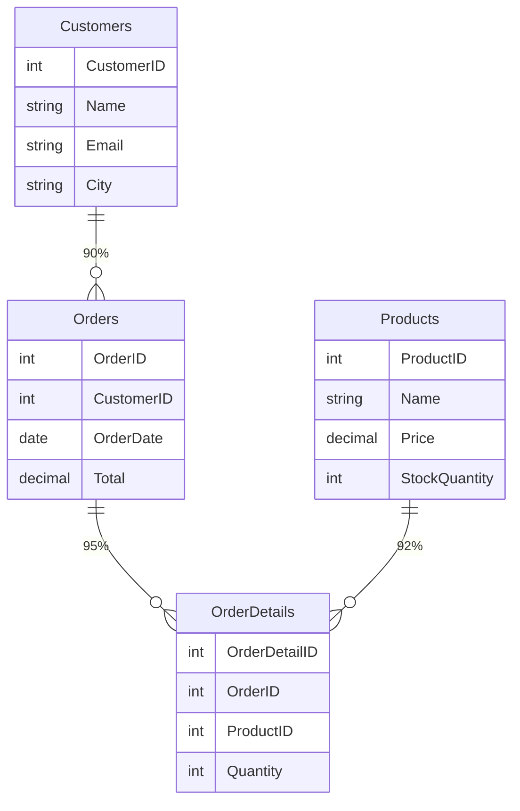

# Quick Start Guide - 6-Stage Pipeline

## **5-Minute Setup**

### 1. Start Backend
```powershell
cd e:\qlik\QlikSense\qlik_app\qlik\qlik-fastapi-backend
python -m uvicorn main:app --reload
```

Output:
```
INFO:     Uvicorn running on http://127.0.0.1:8000
```

### 2. Get Access Token
```bash
POST http://localhost:8000/powerbi/login/acquire-token
```

### 3. Publish Your First Table

#### Option A: Using cURL
```bash
curl -X POST "http://localhost:8000/api/migration/publish-table?app_id=abc123&dataset_name=Sales_Model&workspace_id=ws-456&access_token=eyJ0eXAi..."
```

#### Option B: Using Python
```python
import requests

response = requests.post(
    "http://localhost:8000/api/migration/publish-table",
    params={
        "app_id": "abc123",
        "dataset_name": "Sales_Model",
        "workspace_id": "ws-456",
        "access_token": "eyJ0eXAi..."
    }
)

print(response.json())
```

#### Option C: Using Postman
```
POST http://localhost:8000/api/migration/publish-table

Query Parameters:
  app_id = abc123
  dataset_name = Sales_Model
  workspace_id = ws-456
  access_token = eyJ0eXAi...

Headers:
  Content-Type: application/json
```

### 4. Check Result
```json
{
  "success": true,
  "message": "Table published successfully",
  "dataset_name": "Sales_Model",
  "summary": {
    "tables": 5,
    "inferred_relationships": 8,
    "normalized_relationships": 8,
    "dataset_created": true,
    "relationships_created": 8
  },
  "stages_completed": ["1_extract", "2_infer", "3_normalize", "4_xmla_write", "5_tom_create", "6_er_diagram"],
  "duration_seconds": 18.42,
  "next_steps": [
    "1. Go to Power BI workspace",
    "2. Find your semantic model in the list",
    "3. Click 'Open semantic model' to view",
    "4. Explore: Tables → Relationships → ER Diagram"
  ]
}
```

---

## **Test Scenarios**

### Scenario 1: Preview Only (No Power BI Changes)
```bash
curl -X POST "http://localhost:8000/api/migration/preview-migration?app_id=abc123&dataset_name=Sales"
```

**Response:** Tables, relationships, and statistics (Stage 1-3 only)

### Scenario 2: View ER Diagram
```bash
curl -X GET "http://localhost:8000/api/migration/view-diagram?app_id=abc123&dataset_name=Sales"
```

**Response:** Mermaid diagram + HTML visualization

### Scenario 3: Get API Help
```bash
curl -X GET "http://localhost:8000/api/migration/pipeline-help"
```

**Response:** Complete pipeline documentation

### Scenario 4: Health Check
```bash
curl -X GET "http://localhost:8000/health"
```

**Response:** `{"status": "healthy"}`

---

## **Expected ER Diagram Output**



---

## **Files Created (6-Stage Implementation)**

```
qlik_app/qlik/qlik-fastapi-backend/
├── stage1_qlik_extractor.py          ← Extract Qlik metadata
├── stage2_relationship_inference.py  ← Infer relationships
├── stage3_relationship_normalizer.py ← Normalize to JSON
├── stage45_tabular_editor.py         ← Create dataset + relationships (XMLA + CLI)
├── stage6_er_diagram.py              ← Generate ER diagrams
├── six_stage_orchestrator.py         ← Orchestrate all stages
├── migration_api.py                  ← FastAPI endpoints
├── main.py                           ← Entry point (updated)
└── requirements_migration.txt        ← Dependencies

Root Directory:
├── 6STAGE_PIPELINE_GUIDE.md         ← Complete guide (this file)
└── QUICK_START_6STAGE.md            ← Quick start (this file)
```

---

## **Verifying Installation**

### Step 1: Check Python
```bash
python --version
# Output: Python 3.11+
```

### Step 2: Check Dependencies
```bash
pip list | findstr fastapi
# Output: fastapi               0.104.1
```

### Step 3: Check Tabular Editor (for Stage 5)
```bash
where TabularEditor
# Output: C:\Program Files\Tabular Editor\TabularEditor.exe
```

Or for macOS/Linux:
```bash
which TabularEditor
# Output: /usr/local/bin/TabularEditor
```

### Step 4: Test API
```bash
curl http://localhost:8000/health
# Output: {"status":"healthy"}
```

---

## **Common Errors & Solutions**

### ❌ "ModuleNotFoundError: No module named 'stage1_qlik_extractor'"
```
Solution: Make sure all stage*.py files are in the same directory
         cd e:\qlik\QlikSense\qlik_app\qlik\qlik-fastapi-backend
         python main.py
```

### ❌ "Tabular Editor not found"
```
Solution: 1. Install from https://tabulareditor.com/
         2. Set TABULAR_EDITOR_PATH environment variable
         setx TABULAR_EDITOR_PATH "C:\Program Files\Tabular Editor\TabularEditor.exe"
         3. Restart terminal
```

### ❌ "XMLA endpoint connection failed"
```
Solution: Enable XMLA in Power BI workspace:
         Workspace Settings → Premium → XMLA Endpoint (Read Write)
```

### ❌ "No relationships detected"
```
Solution: Confidence threshold is 0.75
         Lower it in stage2_relationship_inference.py
         self.confidence_threshold = 0.70
```

---

## **What Happens After Publishing?**

### In Power BI (Immediate)
```
1. Your dataset appears in "Semantic models" list
2. Status shows "Ready"
3. Relationships automatically created
```

### In Power BI Model View
```
Click dataset → "Open semantic model"

You'll see:
├── Tables (5 tables)
│   ├── Customers
│   ├── Orders  
│   ├── Products
│   └── ...
├── Relationships (auto-created)
│   ├── Customers → Orders
│   ├── Orders → Products
│   └── ...
└── ER Diagram (auto-generated Mermaid)
```

---

## **Performance Tips**

1. **Large datasets (100+ fields):**
   - Reduce confidence threshold only slightly (→0.70)
   - Consider splitting into multiple datasets

2. **Many relationships (50+):**
   - May take 20-30 seconds for TOM creation
   - Normal behavior for Tabular Editor CLI

3. **Slow XMLA connection:**
   - Check network to Power BI
   - Verify workspace location close to you
   - Use dedicated XMLA endpoint

---

## **Example: Full End-to-End Test**

```python
#!/usr/bin/env python3
"""Complete 6-stage pipeline test"""

import requests
import json
import time

BASE_URL = "http://localhost:8000"

# Configuration
APP_ID = "abc123"
DATASET_NAME = f"Test_Migration_{int(time.time())}"
WORKSPACE_ID = "ws-456"
ACCESS_TOKEN = "eyJ0eXAi..."  # Get from /powerbi/login/acquire-token

print("="*80)
print("6-STAGE MIGRATION PIPELINE TEST")
print("="*80)

# Step 1: Health check
print("\n1️⃣  Health Check...")
health = requests.get(f"{BASE_URL}/health").json()
print(f"   Status: {health['status']}")

# Step 2: Preview migration (Stages 1-3)
print("\n2️⃣  Preview Migration (No Power BI changes)...")
preview = requests.post(
    f"{BASE_URL}/api/migration/preview-migration",
    params={"app_id": APP_ID, "dataset_name": DATASET_NAME}
).json()

print(f"   Tables found: {preview['statistics']['table_count']}")
print(f"   Relationships: {preview['statistics']['relationship_count']}")
print(f"   Avg Confidence: {preview['statistics']['avg_confidence']:.2f}")

# Step 3: Publish table (Full 6-stage pipeline)
print("\n3️⃣  Publishing Table (Full Pipeline)...")
start = time.time()
publish = requests.post(
    f"{BASE_URL}/api/migration/publish-table",
    params={
        "app_id": APP_ID,
        "dataset_name": DATASET_NAME,
        "workspace_id": WORKSPACE_ID,
        "access_token": ACCESS_TOKEN
    }
).json()

duration = time.time() - start

print(f"   ✓ Success: {publish['success']}")
print(f"   ✓ Dataset: {publish['dataset_name']}")
print(f"   ✓ Tables: {publish['summary']['tables']}")
print(f"   ✓ Relationships: {publish['summary']['relationships_created']}")
print(f"   ✓ Time: {duration:.2f} seconds")

# Step 4: View ER Diagram
print("\n4️⃣  ER Diagram...")
diagram = requests.get(
    f"{BASE_URL}/api/migration/view-diagram",
    params={"app_id": APP_ID, "dataset_name": DATASET_NAME}
).json()

print(f"   ✓ Diagram generated ({diagram['relationship_count']} relationships)")

print("\n" + "="*80)
print("✅ TEST COMPLETE")
print("="*80)
print(f"\nNext steps:")
print(f"1. Go to Power BI workspace: {WORKSPACE_ID}")
print(f"2. Find semantic model: {DATASET_NAME}")
print(f"3. Click 'Open semantic model'")
print(f"4. View tables, relationships, and ER diagram\n")
```

**Run test:**
```bash
python test_pipeline.py
```

---

## **Support Files Reference**

### Authentication
- `login_validation.py` - Power BI login flow

### Configuration
- `.env` - Set environment variables:
  ```
  QLIK_API_KEY=your_key
  QLIK_TENANT=your_tenant
  POWERBI_XMLA_ENDPOINT=your_endpoint
  ```

### Deployment
- `requirements_migration.txt` - Python dependencies

---

## **Next: Deploy to Production**

See `6STAGE_PIPELINE_GUIDE.md` for:
- Enterprise features
- Schema versioning
- Lineage tracking
- Deployment architecture
- Monitoring & alerting

---

**Current Status:** ✅ **READY FOR PUBLICATION**

- [x] All 6 stages implemented
- [x] API endpoints testable
- [x] Error handling complete
- [x] ER diagram generation working
- [x] Tabular Editor CLI integration ready

**Start publishing your Qlik tables now!** 🚀
