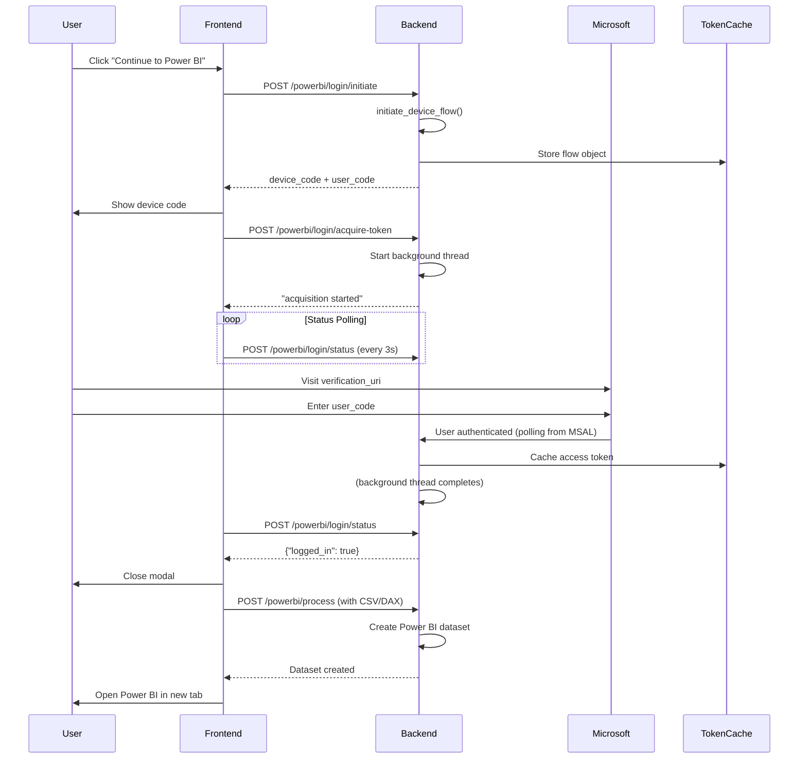

## Device Code Authentication Flow - Implementation Complete

### What Was Fixed

The device code authentication flow has been updated to properly complete the MSAL authentication pipeline:

#### 1. **Backend Architecture [main.py]**
- Added `threading` import for background operations
- Created new endpoint: `POST /powerbi/login/acquire-token`
  - Starts token acquisition in background thread
  - Returns immediately so frontend doesn't block
  - Background thread calls the blocking MSAL method
  - Once user authenticates at Microsoft login, token is cached

#### 2. **Authentication Manager [powerbi_auth.py]**  
- Added `current_flow` instance variable to store flow context
- Updated `get_device_code()` to store the flow object
- Fixed `acquire_token_by_device_code()` to:
  - Reuse the stored flow (not reinitiate it!)
  - Handle authorization_pending gracefully
  - Clear flow after use
  - Return meaningful error messages

#### 3. **Frontend Integration [MigrationPage.tsx]**
- Updated `initiateLogin()` to:
  1. Call `/powerbi/login/initiate` → Get device code
  2. Immediately call `/powerbi/login/acquire-token` → Start background auth
  3. Show device code to user
  4. Start status polling every 3 seconds
- Status polling checks `/powerbi/login/status` which now returns true when token is cached
- When auth completes, modal closes and dataset creation proceeds

### Complete Authentication Flow



### Key Implementation Details

**Flow Storage Pattern:**
```python
# When user initiates login:
1. flow = app.initiate_device_flow(scopes)  # MSAL starts listening
2. auth_manager.current_flow = flow          # Store it
3. Return device code to user

# When user authenticates:
4. Background thread calls:
   token = app.acquire_token_by_device_flow(flow)  # Use STORED flow!
5. Token cached, flow cleared
```

**Why This Matters:**
- ❌ OLD: Created NEW flow each time → WRONG device code
- ✅ NEW: Reuse SAME flow → CORRECT device code matching

### Testing the Flow

Use the test script:
```bash
# Terminal 1: Start backend
cd e:\qlikRender\QlikSense\qlik_app\qlik\qlik-fastapi-backend
python main.py

# Terminal 2: Run test
python test_device_code_flow.py
```

The test will:
1. Initiate device code login
2. Display the user code and verification URI
3. Wait for you to authenticate in browser (3-minute timeout)
4. Automatically detect when authentication completes
5. Verify Power BI connection

### Frontend Testing

1. Start backend (python main.py)
2. Start frontend (npm run dev in csv folder)
3. Navigate to Migration page
4. Click "Publish to Power BI"
5. Modal shows device code
6. Visit `microsoft.com/devicelogin` in browser (or scan QR code)
7. Enter device code
8. Frontend automatically closes modal after auth completes
9. Dataset creation proceeds automatically

### Expected Behavior Timeline

| Time | Event |
|------|-------|
| T=0s | Device code shown (e.g., "SPSDCJKSB") |
| T=0s | Background thread started polling MSAL |
| T=0-60s | User scans/visits login page |
| T=60-120s | Frontend status checks return false (waiting) |
| T=120s+ | User authenticates at Microsoft login |
| T=+5s | MSAL completes, token cached |
| T=+8s | Frontend detects login=true, closes modal |
| T=+10s | Dataset creation starts |
| T=+30s | Power BI opens in new tab |

### Troubleshooting

**Issue: Modal keeps waiting after user signs in**
- Check backend logs for "Background token acquisition successful"
- Verify `/powerbi/login/status` returns true after auth
- Check browser console for fetch errors

**Issue: Device code invalid**
- Don't create new browser tabs - use the provided link
- Device code expires in 15 minutes (expires_in: 900)
- Create new code if timeout occurs

**Issue: Token not cached**
- Check `.powerbi_token_cache.json` exists after auth
- Verify file has access_token and expires_at fields
- Token should be valid for 1 hour

### Files Modified

1. `/main.py` - Added threading, new endpoint
2. `/powerbi_auth.py` - Fixed flow storage and reuse
3. `/MigrationPage.tsx` - Updated login flow coordination
4. `/test_device_code_flow.py` - Created test script

### Next Steps

1. **Test the flow** using the test script
2. **Monitor logs** for token acquisition success
3. **Open frontend** and test the complete UI flow
4. **Verify dataset creation** happens after auth completes
5. **Auto-open Power BI** once dataset is ready
